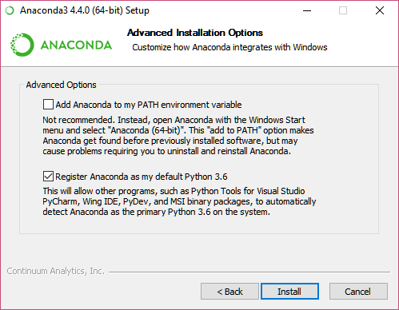
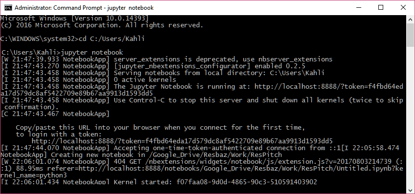
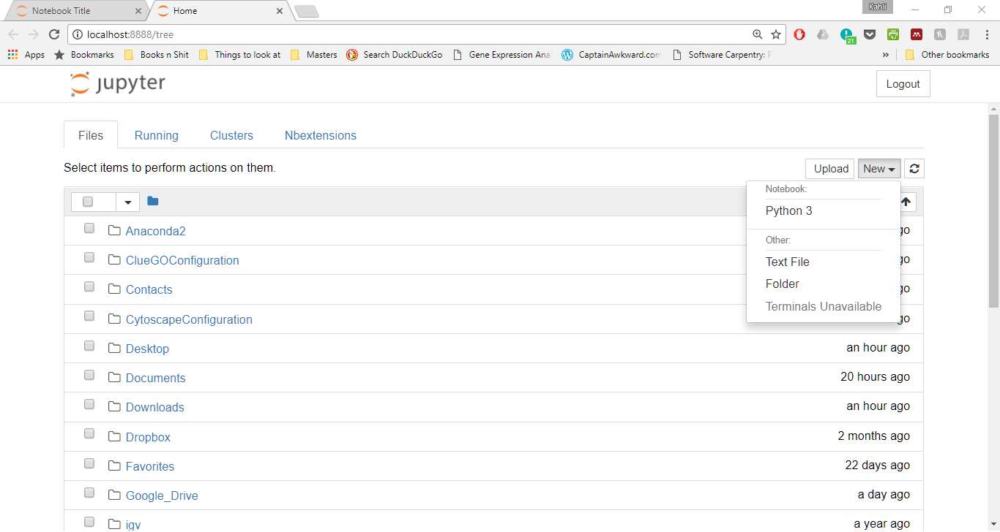
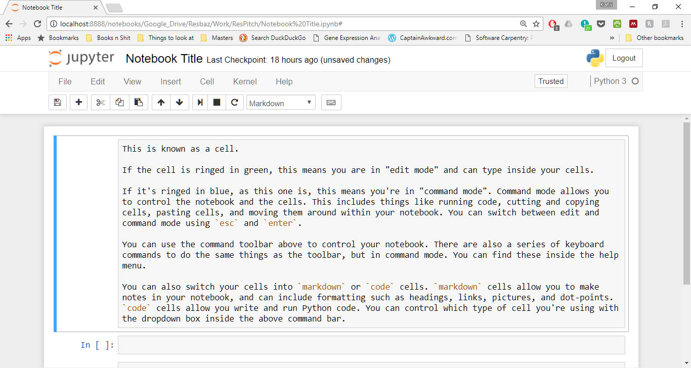

Python
====

Contents
----

1. [Introduction](#introduction)
2. [Installing Python](#installing-python)
   * [Installing Python with Anaconda](#installing-python-with-anaconda)
   * [Installing Python with Miniconda](#installing-python-with-miniconda)
     - [Windows Installation](#windows-installation)
     - [Mac OS X Installation](#mac-os-x-installation)
     - [Linux Installation](#linux-installation)
   * [pip Installation for Advanced Users](#pip-installation-for-advanced-users)
3. [Launching the Jupyter Notebook](#launching-the-jupyter-notebook)

Introduction
----

This is guide for those trying to install Python for the first time, or who already have Python installed and want to install a set of packages/libraries.

The options are:
- Installing through Anaconda — for those people who aren't concerned about space/memory requirements on their computers.
  This installs base Python along with a number of useful packages.
- Miniconda — installs base Python, and allows the user to control which packages to install. Good for people with limited space.
- Package specific — for those who already have Python installed via pip.

These instructions will also cover installation of the Jupyter Notebook.
This is a development environment that makes it easier to learn Python,
and it is referred to in the Python chapter of the ResBook.

Installing Python
----

### Installing Python with Anaconda

Anaconda is a Python distribution platform which allows you to install and manage up to 720 different Python packages through the Anaconda installer, `conda`.
If you have at least 400MB of free space on your laptop, then I would recommend using this, as it will automatically install many of the packages that you will find useful for your research and future coding.

Just navigate to the [Anaconda home page](https://www.continuum.io/downloads) and follow the instructions to download Python version 3.6 for your Windows, Mac or Linux device.

For Windows devices — if you are not sure and are using windows 7, 8, 9 or 10, then download the 64-bit exe installer.

Please ensure that you allow Anaconda to register it's version as Python as the default on your device.
This means that, if you already have Python installed (as MacOS and Linux does natively),
you are allowing Anaconda to use it's own version of Python — and the associated packages — when you are coding.
If you change this option you will run into errors when trying to use your packages, and in particular, when trying to run the Jupyter Notebook.

### Installing Python with Miniconda

This is the better option for people with limited memory left on their device.
This option will install base Python onto your device, and allows you to install specific packages according to your requirements.

#### Windows Installation

1. Download the *Python 3.x (exe installer)* from [Miniconda](https://conda.io/miniconda.html).
  Most people will want the 64-bit exe installer, especially for Windows 7 or newer.

2. Run the exe installer and install using default choices, by clicking *next* as many times as needed.
  (The installation might take a few minutes if the computer is slow.
  You can click "Show Details" to see the installation progress.)

3. When installation is complete, find and open a program called `Select Anaconda Prompt` from the Windows Start Menu.

  This will open a new window with a black background (it might keep blinking if the computer is slow).
  Wait until you can start typing.

4. Type `conda install jupyter` and hit `ENTER` key.
  When asked do you want to proceed, type `y` and hit `ENTER`.

  This will take a few minutes to download the Jupyter packages.

  If you wish to install more packages in the future, you just need to use the `conda install <package name>` from your command line.

5. To view a list of packages and versions installed, or to confirm that a package has been added or removed, type `conda list`.
  Confirm that `jupyter`, `numpy` and `matplotlib` packages have been installed

6. If you want to launch Jupyter now, go to the [Launching Jupyter Notebook section below](#launching-the-jupyter-notebook).

7. If you need to uninstall Miniconda for any reason, you can do this through "Add or remove Program" in the control panel, by removing "Python 3.6(Miniconda)"

#### Mac OS X Installation

1. In your browser download the Python 3.6 Miniconda installer for OS X from https://conda.io/miniconda.html, then in your terminal window type the following:

  `bash Miniconda3-latest-MacOSX-x86_64.sh`

2. Follow the prompts on the installer screens.
  If unsure about any setting, simply accept the defaults as they all can be changed later.
  After installation is complete, close your terminal window.

3. Re-open your terminal window, and type `conda --version` into the command terminal to test that Miniconda has been installed.
  Conda should respond with the version number that you have installed, like: conda 3.11.0

  NOTE: If you see an error message, check to see that you are logged into the same user account that you used to install Anaconda or Miniconda, and that you have closed and re-opened the terminal window after installing it.

4. Type `conda install jupyter numpy matplotlib` and hit `ENTER` key.
  When asked do you want to proceed, type `y` and hit `ENTER`.
  If you wish to install more packages in the future, you just need to use this `conda install <package name>` from your command line.

5. To view a list of packages and versions installed, or to confirm that a package has been added or removed, type `conda list`.
  Confirm that `jupyter`, `numpy` and `matplotlib` have been installed.

6. If you want to launch Jupyter now, go to the [Launching Jupyter Notebook section below](#launching-the-jupyter-notebook).

7. If you need to uninstall Miniconda for any reason, open a terminal window and remove the entire Miniconda install directory by typing: `rm -rf ~/miniconda`

  You may also edit `~/.bash_profile` and remove the Miniconda directory from your `PATH` environment variable, and remove the hidden `.condarc` file and `.conda` and `.continuum` directories which may have been created in the home directory with: `rm -rf ~/.condarc ~/.conda ~/.continuum`

#### Linux Installation

1. In your browser download the Python 3.6 Miniconda installer for OS X from https://conda.io/miniconda.html, then in your terminal window type the following:

  `bash Miniconda3-latest-Linux-x86_64.sh`

2. Follow the prompts on the installer screens.
  If unsure about any setting, simply accept the defaults as they all can be changed later.
  After installation is complete, close your terminal window.

3. Close and re-open your terminal window.
  Type `conda --version` into the command terminal to test that Miniconda has been installed.
  Conda should respond with the version number that you have installed, like: conda 3.11.0

4. Type `conda install jupyter numpy matplotlib` and hit `ENTER` key.
  When asked do you want to proceed, type `y` and hit `ENTER`.
  If you wish to install more packages in the future, you just need to use this `conda install <package name>` from your command line.

5. To view a list of packages and versions installed, or to confirm that a package has been added or removed, type `conda list`.
  Confirm that jupyter, numpy and matplotlib have been installed

6. If you want to launch Jupyter now, go to the [Launching Jupyter Notebook section below](#launching-the-jupyter-notebook).

7. If you need to uninstall Miniconda for any reason, open a terminal window and remove the entire Miniconda install directory: `rm -rf ~/miniconda`.

  You may also edit `~/.bash_profile` and remove the Miniconda directory from your `PATH` environment variable, and remove the hidden `.condarc` file and `.conda` and `.continuum` directories which may have been created in the home directory with: `rm -rf ~/.condarc ~/.conda ~/.continuum`

## pip Installation for Advanced Users

As an existing Python user, you may wish to install Jupyter using Python’s package manager, pip, instead of Anaconda.

Jupyter installation requires Python 3.3 or greater, or Python 2.7.
Please ensure you have these installed first before proceeding.

1. Ensure that you have the latest pip; older versions may have trouble with some dependencies: `pip3 install --upgrade pip`
  (Use `pip` instead of `pip3` if using legacy Python 2.)

2. Install the Jupyter Notebook using: `pip3 install jupyter` (Use `pip` instead of `pip3` if using legacy Python 2).
  Close and re-open your terminal window.
  Similarly, if you wish to install other packages in the future, you can use `pip3 install <package names>`.

Launching the Jupyter Notebook
----

As explained above, Jupyter is a development environment widely used for Python.
It makes it easier to learn Python, and it is referred to in the Python chapter of the ResBook.
Jupyter is launched from your command prompt (windows) or command terminal (MacOS/Linux), which you can find by searching your applications.

After opening the command terminal, you should see a black screen and a `>` prompt after a file path, usually within your `C:\\` drive.
When Jupyter launches, it sets its "home" folder to be the folder you are in when you launch the notebook, and it can access any sub-folders and files within that location.
This means it's in our best interest to launch from an area where we'll be able to access _all_ of the files we'll require.
Your home directory is often a sensible choice.

Therefore, in your terminal, type `cd C:/Users/<YourUserName>` (Windows) or just `cd` (MacOS, Linux).
Once there, type in the command `jupyter notebook` to launch Jupyter.

You should then see the terminal generate a bunch of text before opening the jupyter home page within a browser window.
This should be within whichever web browser application is currently set as your default.
You can change this in your settings.

(MacOS/Linux) If the terminal does not automatically open within your browser, you can copy the `http://localhost:8888/...etc` link from the terminal into a new browser tab.

The browser tab should now be open to the Jupyter home folder, which will look something like this:

You can click on the blue links inside the main console to navigate through your folders and files.
To the top-right of your files box are some command buttons.
These allow you to do things like create new folders, new text (`*.txt`) files, or a new iPython notebook.
We will be writing and running our code from inside these `*.ipynb` files.

When you create a new `*.ipynb` notebook, you'll get something that looks like this, except empty:

Play around with the notebook, and have a look to see what you can do.
If you'd like a more guided tour/playbox, you can find one
[here](http://nbviewer.jupyter.org/github/jupyter/notebook/blob/master/docs/source/examples/Notebook/Notebook%20Basics.ipynb).
