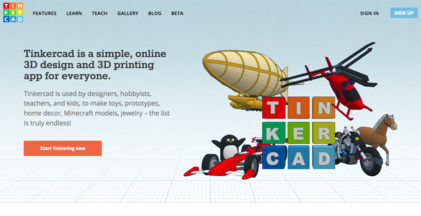

TinkerCAD
====

TinkerCAD is a free web based program.
Simply create an account and you will be able to login from any computer, just like a facebook account.
TinkerCAD will store all your designs so you can access them from anywhere.

Create your TinkerCAD account: https://www.tinkercad.com/

_Figure 5. The TinkerCAD website_

Upon creating your account TinkerCAD opens with a short tutorial to introduce you to the software.
Make sure to watch this video as TinkerCAD will only start saving your designs after completing the tutorial.

Watch it now before moving on with this chapter to familiarise yourself with the software.
